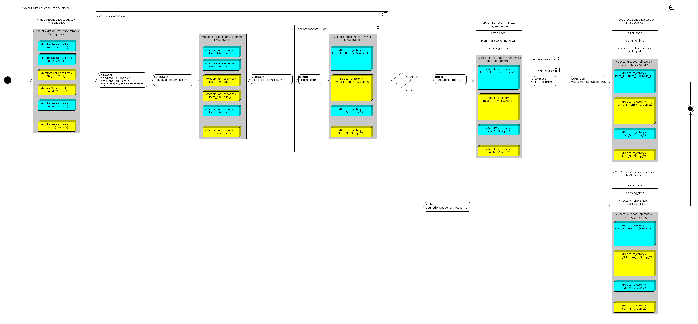
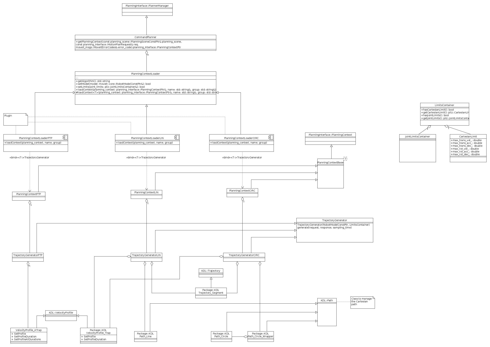
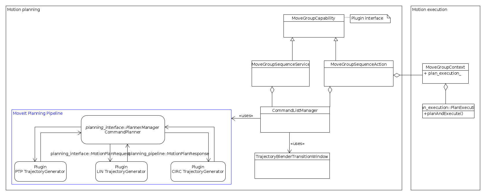

# Trajectory generation

## Overview sequence processing
The following diagram shows the steps to process and execute
a list of commands given as sequence. The diagram also shows the resulting data
structures of each processing step.

## Overview classes PlanningContext
The following diagram shows the different classes responsible for the loading
of the different planning contexts (e.g. Ptp, Lin, Circ) and the
relationship between them.

## Relationship MoveGroupCapabilities and ComandListManager
The following diagram shows the relationship between the MoveGroupCapabilities
and the CommandListManager.

## Blending algorithm description
A description of the used blending algorithm can be found
[here](MotionBlendAlgorithmDescription.pdf).
