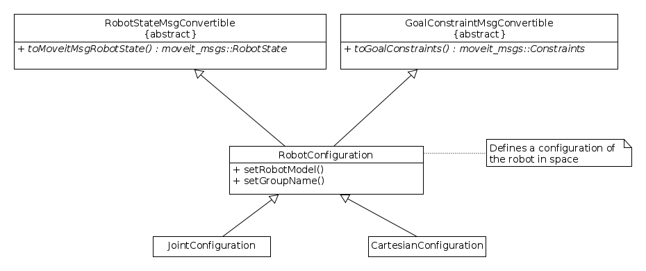
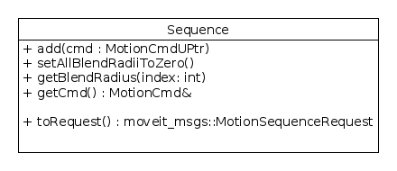
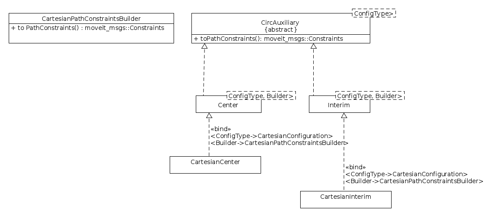
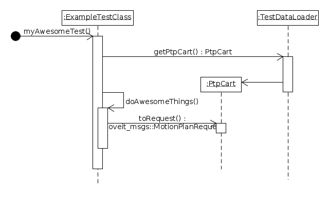

# Test data provider/loader

## General information
- Use as little as possible test points (Reason: Reduces maintenance overhead).
- Test points should be defined following the concept shown below.

- Test points can be defined in joint space or Cartesian space. However, one
test point should not be defined in both spaces (data redundancy)
- If a test point is defined in Cartesian space, then also state the
corresponding seed.
- Store preferably only valid test points and test commands. You can use the
valid test points and test commands to create invalid test points or commands if
needed (Reason: Reduces maintenance overhead).

## Diagrams/ Data types
- The following diagrams show the main classes which can be loaded from the
test data provider/loader, and the relationship between them.

### Robot configurations

### Command types

### Circ auxiliary types

## Usage
The usage of the TestDataLoader is as shown below.

The idea is that the TestdataLoader returns high level data abstraction classes
which can then directly be used to generate/build the ROS messages needed
for testing.
