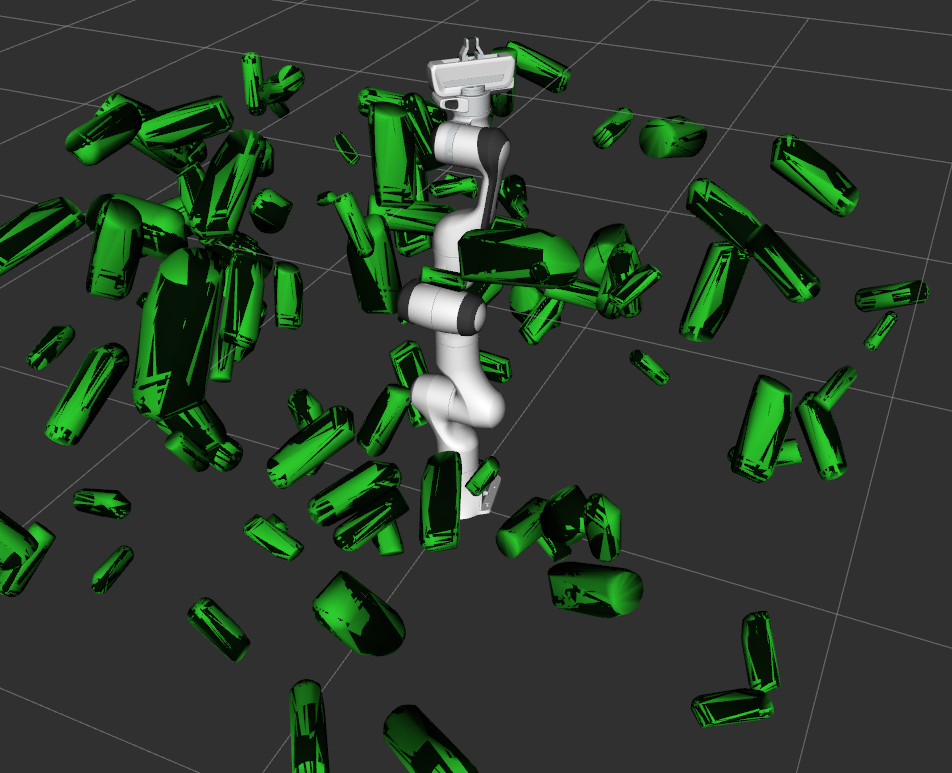
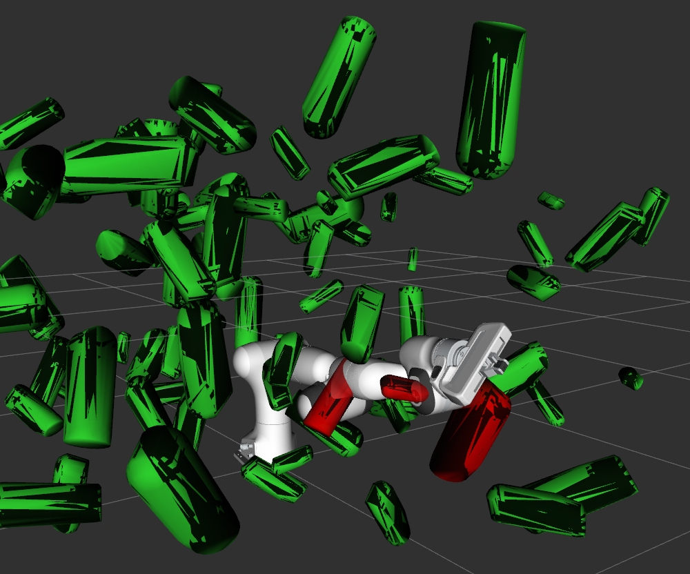
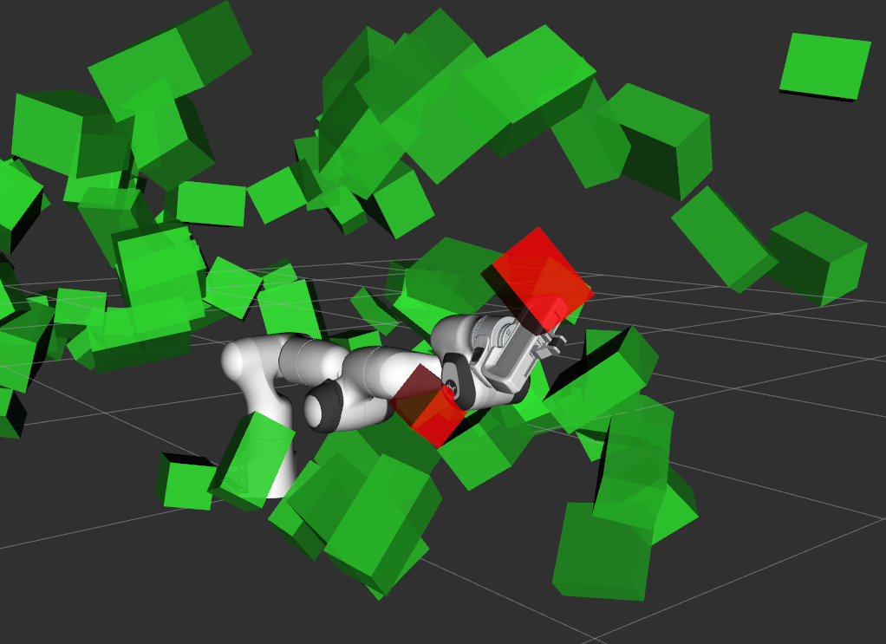

# Planning Component Tools

## Compare collision checking speeds: FCL vs Bullet
The launch file `collision_checker_compare.launch` starts a benchmark between FCL and Bullet as a collision detection library. The script `compare_collision_speed_checking_fcl_bullet.cpp` performs the actual speed tests.

The collision scenarios can be visualized. By default, visualization is turned off in the launch file but can be activated through `visualization:=true` as an argument to the `roslaunch`. If activated, rviz is launched and visualizations like in the images below are created. For the speed test, either meshes or other available shape primitives like the box can be used.

The clutter world objects are randomly placed such that they don't collide with the robot. The robot can then be moved to a colliding configuration. In the images, the red color of world objects indicates a collision with the robot.

    
    
    

The results of the speed test are printed to the console. Their unit is collision checks per second. A current overview over the results is given in the table below. Note that absolute values are not relevant because they are depending on the computing power of the local machine but the relative differences between Bullet and FCL should be reproducible.

| Collision environment | Bullet | FCL |
| :--------------- |------------:| ----:|
| Robot self check, no collision |  220,000 | 110,000 |
| World clutter 100 meshes, no collision | 37,000 | 38,000 |
| World clutter 100 meshes, 4 in collision | 8,000 | 3,000 |
