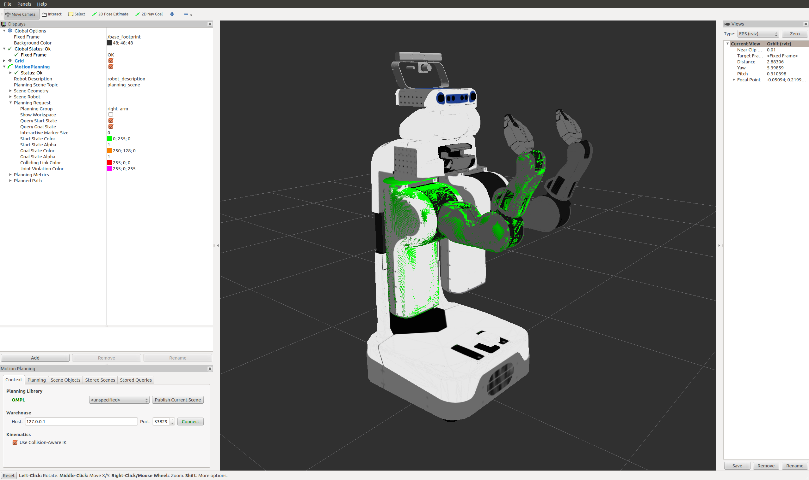
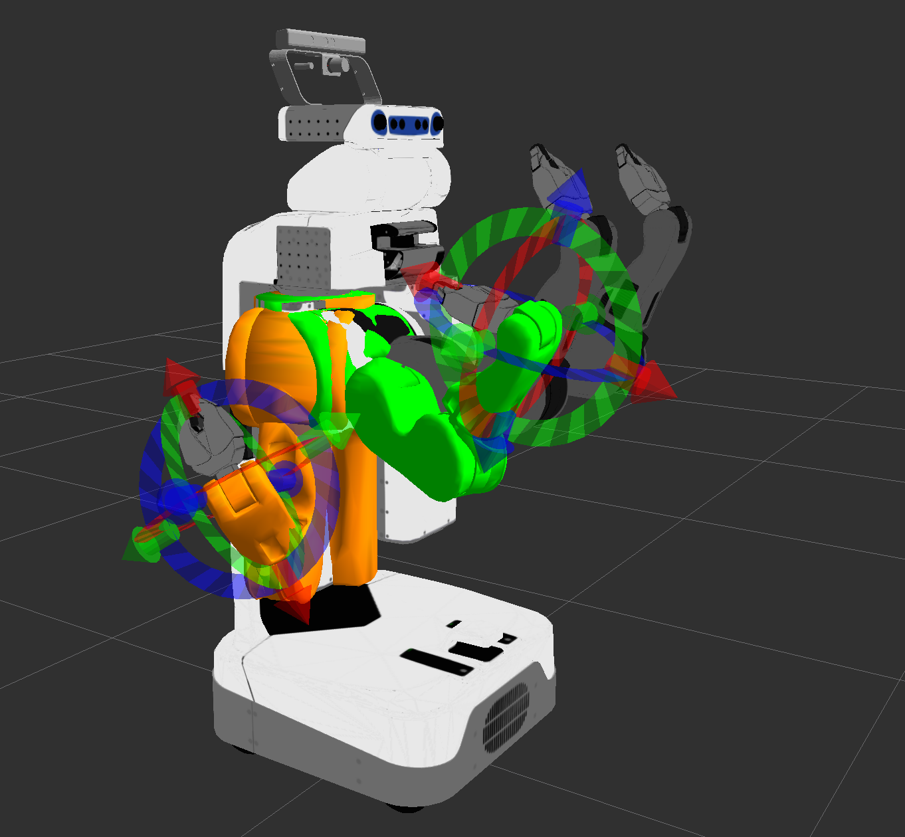
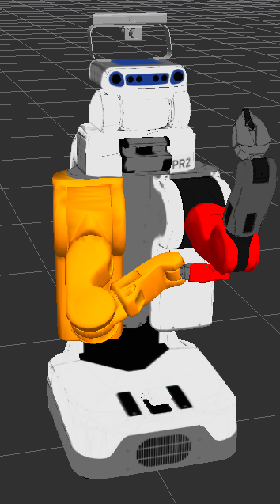
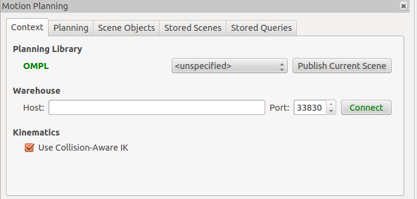
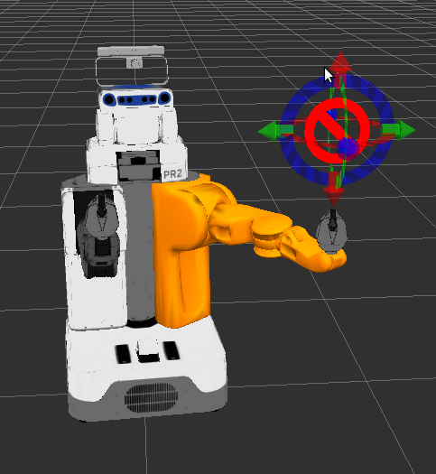
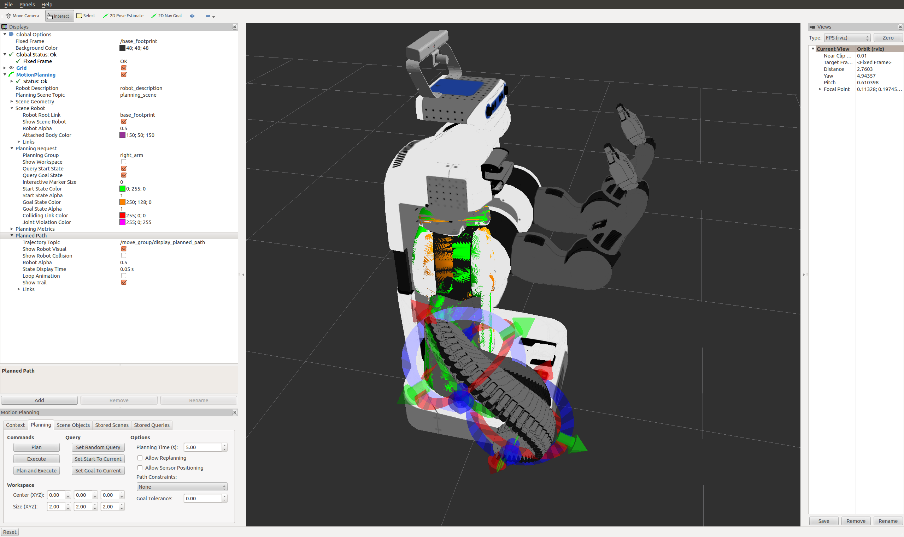

MoveIt! RViz Plugin Tutorial
@@@@@@@@@@@@@@@@@@@@@@@@@@@@

MoveIt! comes with a plugin for the ROS Visualizer (RViz). The plugin
allows you to setup scenes in which the robot will work, generate
plans, visualize the output and interact directly with a visualized
robot. We will explore the plugin in this tutorial.

Pre-requisites
==============

You should have completed the `MoveIt! Setup Assistant tutorial
<http://docs.ros.org/api/moveit_setup_assistant/html/doc/tutorial.html>`_
and you should now have a MoveIt! configuration for the PR2 that you
can use.  This tutorial assumes the generated MoveIt! configuration
package is called "pr2_moveit_config".

Alternately, you can just install the pre-made MoveIt! configuration
for the PR2 in the pr2_moveit_config ROS package.  To install it,
run::

  sudo apt-get install ros-hydro-moveit-pr2

This tutorial does **not** require you to actually have a PR2 robot,
it just needs a set of working robot model files.

Start
=====

STEP 1: Launch the demo and Configure the Plugin
------------------------------------------------
 
* Launch the demo::

   roslaunch pr2_moveit_config demo.launch

* If you are doing this for the first time, you will have to add the Motion Planning Plugin.

  * In the Rviz Displays Tab, press *Add*

  * From the moveit_ros_visualization folder, choose "MotionPlanning" as the DisplayType. Press "Ok".

.. image:: rviz_plugin_motion_planning_add.png
   :width: 300px

* In the "Global Options" tab of the "Displays" subwindow, set the **Fixed Frame** field to "/odom_combined"

* Now, you can start configuring the Plugin for your robot (the PR2 in
  this case).  Click on "MotionPlanning" in "Displays".

  * Make sure the **Robot Description** field is set to "robot_description"

  * Make sure the **Planning Scene Topic** field is set to "planning_scene".

  * In **Planning Request**, change the **Planning Group** to "right_arm".

  * Set the **Trajectory Topic** in the Planned Path tab to "/move_group/display_planned_path".

STEP 2: Play with the visualized robots
---------------------------------------
There are four different visualizations active here currently:

#. The start state for motion planning (the planned group is represented in green).

#. The goal state for motion planning (the planned group is represented in orange).

#. The robot's configuration in the planning scene/ planning environment 

#. The planned path for the robot,

The display states for each of these visualizations can be toggled on and off using checkboxes.

#. The start state using the "Query Start State" checkbox in the "Planning Request" tab.

#. The goal state using the "Query Goal State" checkbox in the "Planning Request" tab.

#. The planning scene robot using the "Show Scene Robot" checkbox in the "Scene Robot" tab.

#. The planned path using the "Show Robot Visual" checkbox in the "Planned Path" tab.

.. image:: rviz_plugin_visualize_robots.png
   :width: 500px

* Play with all these checkboxes to switch on and off different visualizations.

STEP 3: Interact with the PR2
-----------------------------

  * Press **Interact** in the top menu of rviz. You should see a
    couple of interactive markers appear for the right arm of the PR2.

    * One marker (corresponding to the orange colored right arm) will
      be used to set the "Goal State" for motion planning. Another
      marker corresponding to a green colored representation of the
      right arm will be used to set the "Start State" for motion
      planning.

    * You will be able to use these markers (which are attached to the
      tip link of each arm) to drag the arm around and change its
      orientation.

Moving into collision
^^^^^^^^^^^^^^^^^^^^^

Note what happens when you try to move one of the arms into collision
with the other. The two links that are in collision will turn red.

The "Use Collision-Aware IK" checkbox allows you to toggle the
behavior of the IK solver. When the checkbox is ticked, the solver
will keep attempting to find a collision-free solution for the desired
end-effector pose. When it is unticked, the solver will allow
collisions to happen in the solution. The links in collision will
always still be visualized in red, regardless of the state of the
checkbox.

Moving out of reachable workspace
^^^^^^^^^^^^^^^^^^^^^^^^^^^^^^^^^

Note also what happens when you try to move an end-effector out of its
reachable workspace (sometimes the access denied sign will not
appear).

STEP 4: Use Motion Planning with the PR2
----------------------------------------

* Now, you can start motion planning with the PR2 in the MoveIt! Rviz Plugin. 

  * Move the Start State to a desired location.

  * Move the Goal State to another desired location.

  * Make sure both states are not in collision with the robot itself.

  * Make sure the Planned Path is being visualized. Also check the
    "Show Trail" checkbox in the Planned Path tab.

* In the Planning tab (at the bottom), press the Plan button. You
  should be able to see a visualization of the arm moving and a trail.

What's Next
@@@@@@@@@@@

* `MoveIt! and a simulated robot
  <http://moveit.ros.org/wiki/PR2/Gazebo/Quick_Start>`_ - You can now
  start using MoveIt! with a simulated robot in Gazebo.

Links
@@@@@

* Back to :moveit_website:`Moveit Tutorials <tutorials>`
