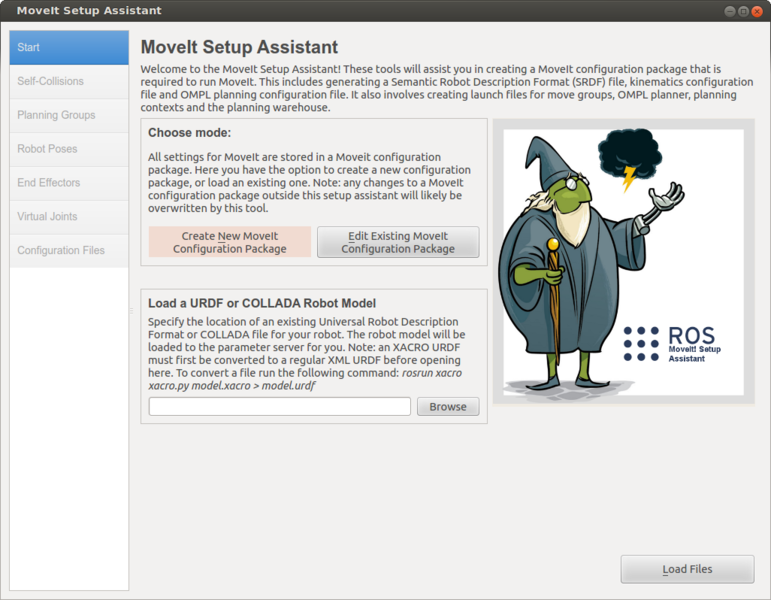
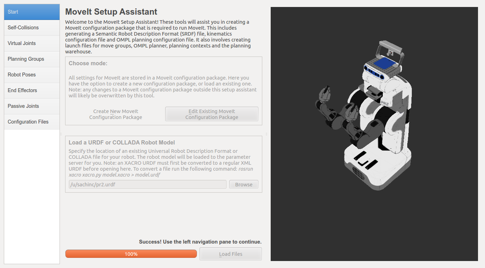
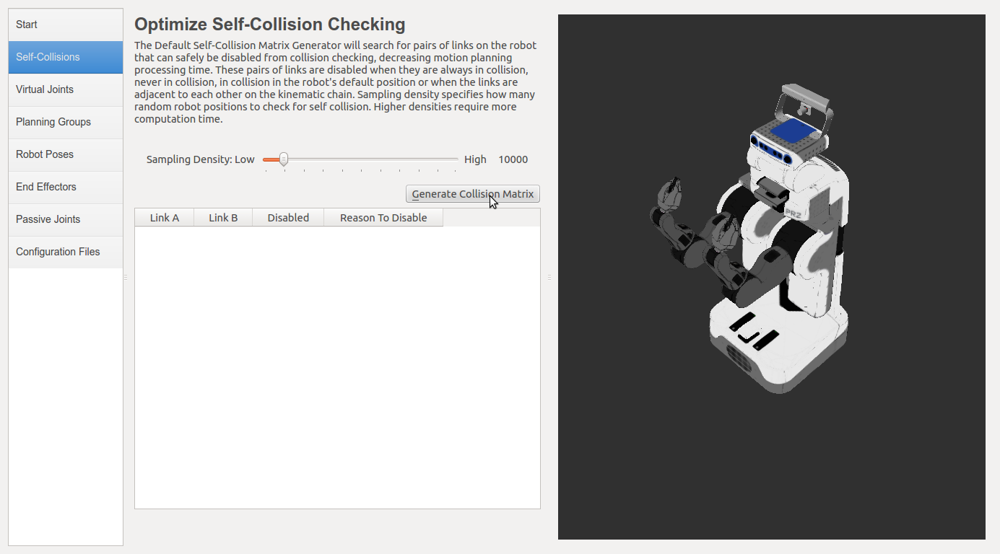
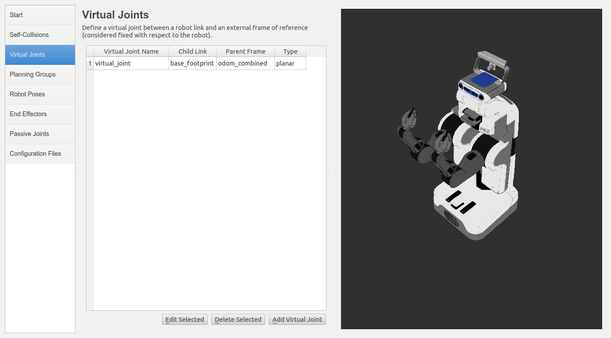
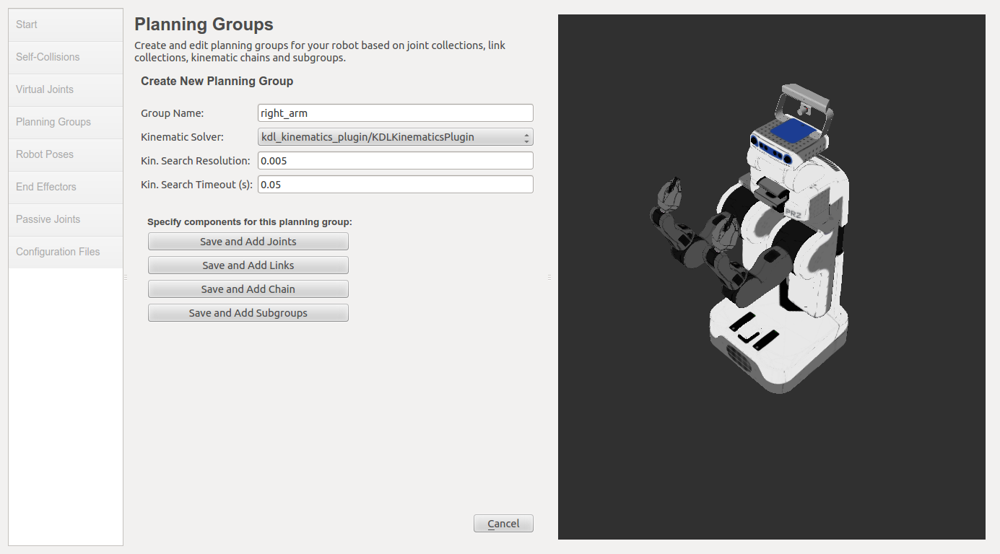
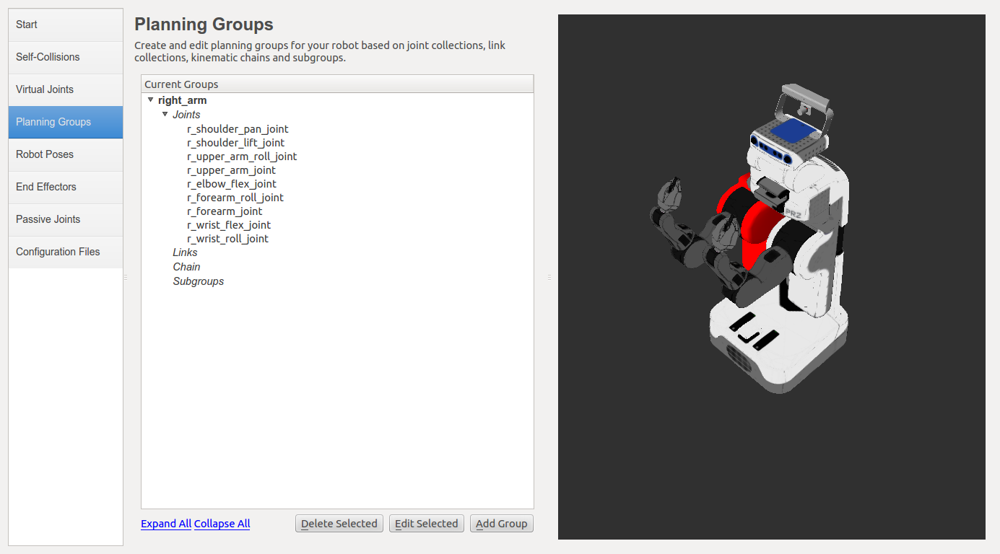
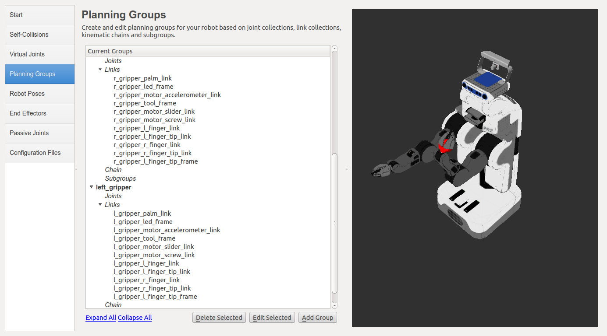
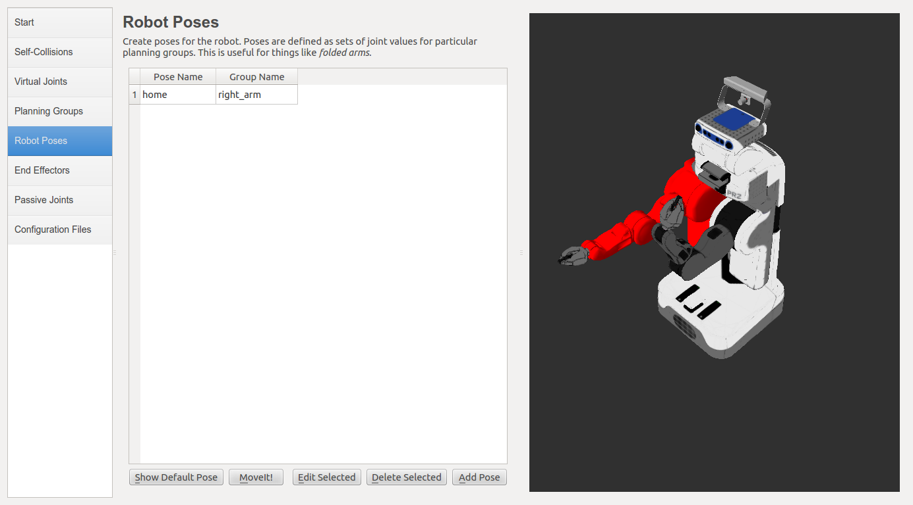
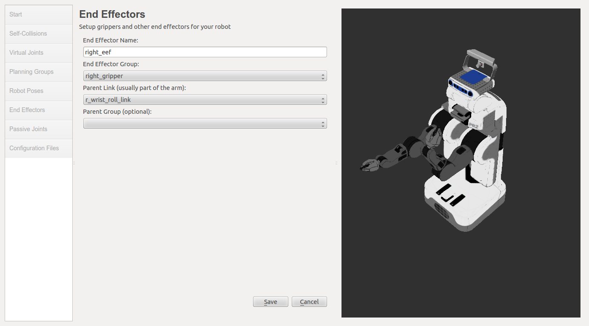

MoveIt! Setup Assistant Tutorial
@@@@@@@@@@@@@@@@@@@@@@@@@@@@@@@@

Overview
========

The MoveIt! Setup Assistant is a graphical user interface for
configuring any robot for use with MoveIt!. Its primary function is
generating a Semantic Robot Description Format (SRDF) file for your
robot. Additionally, it generates other necessary configuration files
for use with the MoveIt! pipeline. To learn more about the SRDF, you
can go through the `SRDF Overview <http://moveit.ros.org/wiki/SRDF>`_
page.

Pre-requisites
==============

MoveIt! and ROS
---------------

* Follow the instructions for :moveit_website:`installing MoveIt!<install>`
  first if you have not already done that.

Using the Setup Assistant
=========================

STEP 1: Start
-------------

* To start the MoveIt! Setup Assistant::

   roslaunch moveit_setup_assistant setup_assistant.launch

* This will bringup the start screen with two choices: *Create New
  MoveIt! Configuration Package* or *Edit Existing MoveIt!
  Configuration Package*.

* Click on the *Create New MoveIt! Configuration Package* button to
  bring up the following screen:

* Click on the browse button and navigate to the *pr2.urdf.xacro* file
  installed when you installed ros-hydro-moveit-full-pr2. (This file
  gets installed in
  /opt/ros/hydro/share/pr2_description/robots/pr2.urdf.xacro on Ubuntu
  with ROS Hydro.)  Choose that file and then click *Load Files*. The
  Setup Assistant will load the files (this might take a few seconds)
  and present you with this screen:

STEP 2: Generate Self-Collision Matrix
--------------------------------------

The Default Self-Collision Matrix Generator searches for pairs of
links on the robot that can safely be disabled from collision
checking, decreasing motion planning processing time. These pairs of
links are disabled when they are always in collision, never in
collision, in collision in the robot's default position or when the
links are adjacent to each other on the kinematic chain. The sampling
density specifies how many random robot positions to check for self
collision. Higher densities require more computation time while lower
densities have a higher possibility of disabling pairs that should not
be disabled. The default value is 10,000 collision checks. Collision
checking is done in parallel to decrease processing time.

* Click on the *Self-Collisions* pane selector on the left-hand side
  and click on the *Regenerate Default Collision Matrix* button. The
  Setup Assistant will work for a few second before presenting you the
  results of its computation in the main table.

|before| → |after|

.. |after| image:: setup_assistant_pr2_self_collisions_done.png
   :width: 500px
   :align: middle

STEP 3: Add Virtual Joints
--------------------------

Virtual joints are used primarily to attach the robot to the
world. For the PR2 we will define only one virtual joint attaching the
*base_footprint* of the PR2 to the *odom_combined* world
frame. This virtual joint represents the motion of the base of the
robot in a plane.

* Click on the *Virtual Joints* pane selector. Click on *Add Virtual Joint*

* Set the joint name as "virtual_joint"

* Set the child link as "base_footprint" and the parent frame name as "odom_combined".

* Set the Joint Type as "planar". 

* Click *Save* and you should see this screen:

STEP 4: Add Planning Groups
---------------------------

Planning groups are used for semantically describing different parts
of your robot, such as defining what an arm is, or an end effector.

* Click on the *Planning Groups* pane selector.

* Click on *Add Group* and you should see the following screen:

Add the right arm
^^^^^^^^^^^^^^^^^

* We will first add the PR2 right arm as a planning group

  * Enter *Group Name* as **right_arm**

  * Choose *kdl_kinematics_plugin/KDLKinematicsPlugin* as the
    kinematics solver. *Note: if you have a custom robot and would
    like a powerful custom IK solver, see
    `Kinematics/IKFast<http://moveit.ros.org/wiki/Kinematics/IKFast>`_*

  * Let *Kin. Search Resolution* and *Kin. Search Timeout* stay at
    their default values.

* Now, click on the *Save and Add Joints* button. You will see a
  list of joints on the left hand side. You need to choose all the
  joints that belong to the right arm and add them to the right hand
  side. The joints are arranged in the order that they are stored in
  an internal tree structure. This makes it easy to select a serial
  chain of joints.

  * Click on **r_shoulder_pan_joint**, hold down the **Shift**
    button on your keyboard and then click on the
    *r_wrist_roll_joint*. Now click on the **>** button to add these
    joints into the list of selected joints on the right.

.. image:: setup_assistant_pr2_right_arm_joints.png
   :width: 700px

* Click *Save* to save the selected group. Note that each arm of the
  PR2 has only 7 joints and yet we added 9 joints here. Some of the
  joints (r_upper_arm_joint and r_forearm_joint) are **Fixed** joints
  and will not be used for planning or kinematics.

Add the left arm
^^^^^^^^^^^^^^^^

Now, add the left arm in a similar manner choosing the joints from the
l_shoulder_pan_joint to the l_wrist_roll_joint.

Add the grippers
^^^^^^^^^^^^^^^^

* We will also add two groups for the right and left end
  effectors. NOTE that you will do this using a different procedure
  than adding the arms.

  * Click on the *Add Group* button.

  * Enter *Group Name* as **right_gripper**

  * Let *Kin. Search Resolution* and *Kin. Search Timeout* stay at their default values.

  * Click on the *Save and Add Links* button.

  * Choose all links that start with **right_gripper** and add them
    to the list of *Selected Links* on the right hand side.

  * Click *Save*

  * Repeat the same procedure for the left arm of the PR2, choosing
    links that start with **left_gripper** instead of
    **right_gripper** this time.

STEP 5: Add Robot Poses
-----------------------
The Setup Assistant allows you to add certain fixed poses into the
configuration. This helps if, for example, you want to define a
certain position of the robot as a **Home** position.

* Click on the *Robot Poses* pane. 

* Click *Add Pose*. Choose a name for the pose. The robot will be in
  its *Default* position where the joint values are set to the
  mid-range of the allowed joint value range. Move the individual
  joints around until you are happy and then *Save* the pose. Note
  how poses are associated with particular groups. You can save
  individual poses for each group.

* **IMPORTANT TIP**: Try to move all the joints around. If there is
  something wrong with the joint limits in your URDF, you should be able
  to see it immediately here.

STEP 6: Label End Effectors
---------------------------

We have already added the right and left grippers of the PR2. Now, we
will designate these two groups as special groups:
**end-effectors**. Designating these groups as end effector allows
some special operations to happen on them internally.

* Click on the *End Effectors* pane. 

* Click *Add End-Effectors*.

* Choose **right_eef** as the *End Effector Name* for the right gripper.

* Select **right_gripper** as the *End Effector Group*.

* Select **r_wrist_roll_link** as the *Parent Link* for this end-effector.

* Leave *Parent Group* blank.

* Click *Save*.

* Add the **left_eef** in a similar manner.

STEP 7: Add Passive Joints
--------------------------

The passive joints tab is meant to allow specification of any passive
joints that might exist in a robot. This tells the planners that they
cannot (kinematically) plan for these joints. Examples of passive
joints include passive casters. The PR2 does not have any passive
joints so we will skip this step.

STEP 8: Generate Configuration Files
------------------------------------

You are almost there. One last step - generating all the configuration
files that you will need to start using MoveIt!

* Click on the *Configuration Files* pane. Choose a location and
  name for the ROS package that will be generated containing your new
  set of configuration files (e.g. click browse, select a good
  location (e.g. your home dir), click **Create New Folder**, enter
  "pr2_moveit_generated", and click **Choose**.
  "pr2_moveit_generated" is the location used in the rest of the
  documentation on this wiki). This does not have to be within your
  ROS package path. All generated files will go directly into the
  directory you have chosen.

* Click on the *Generate Package* button. The Setup Assistant will
  now generate and write a set of launch and config files into the
  directory of your choosing. All the generated files will appear in the
  Generated Files/Folders tab and you can click on each of them for a
  description of what they contain.

.. image:: setup_assistant_pr2_done.png
   :width: 700px

* Congratulations!! - You are now done generating the configuration
  files you need for MoveIt!

What's Next
@@@@@@@@@@@

The MoveIt! Rviz plugin
=======================

* Start looking at how you can use the generated configuration files
  to play with MoveIt! using the
  `MoveIt! Rviz Plugin <http://moveit.ros.org/wiki/PR2/Rviz_Plugin/Quick_Start>`_.

Setup IKFast Inverse Kinematics Solver
======================================

* A faster IK solver than the default KDL solver, but takes some
  additional steps to setup:
  `Kinematics/IKFast <http://moveit.ros.org/wiki/Kinematics/IKFast>`_

Additional Reading
@@@@@@@@@@@@@@@@@@

The SRDF
========

* See the `SRDF <http://moveit.ros.org/wiki/SRDF>`_ page for more
  details on the components of the SRDF mentioned in this tutorial.

URDF
====

* The URDF is the native robot description format in ROS and allows
  you to describe the kinematics, inertial, visual and sensing
  properties of your robot. Read through the `URDF specific
  documentation <http://moveit.ros.org/wiki/URDF>`_ to see how the
  URDF is used with MoveIt!

Links
@@@@@

* Back to :moveit_website:`MoveIt! Tutorials<tutorials>`
